# 局域网联机二十四点对战

这是上海交通大学-cs金课-(2024-2025-1)-CS2309-02-问题求解与实践的大作业

项目地址: [SusieGlitter/puzzle24_LANbattle](https://github.com/SusieGlitter/puzzle24_LANbattle)

## 自动求解
这是课程要求的基础功能, 功能为读入题目, 求解并且导出解答
### UI展示

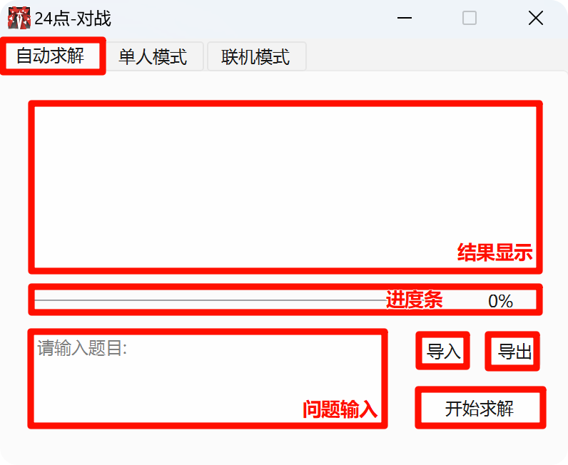

### 通过文本框输入题目
可以通过```问题输入```的文本框进行问题的输入

**输入格式:** 

* 分为多行, 每行四个数字或字母, 分隔符为空格或制表符
* 字母将会简单替换为数字, 规则为: A/a->1  J/j->11  Q/q->12  K/k->13
* 这四个数字即为一道二十四点的题面
* 除上述提到的其他字符将会被直接过滤

### 通过文件导入题目
可以使用```导入```按钮, 从文件导入题面, 导入后将使用文件文本内容覆盖```问题输入```中的内容

### 求解 进度条 结果显示
按下```开始求解```按钮, 程序将会读取当前```问题输入```中的题面进行求解, ```进度条```用于指示求解进度, 并实时将已经求解的题目展示在```结果显示```中

**输出格式:**

```结果显示```的每行将会对应```问题输入```对应行的题目

* 若输入格式有问题(数字数量不匹配/数字范围超出二十四点限制), 将会输出```error```
* 若输入题目无解, 将会输出```No solution```
* 若输入题目存在解, 将会输出长度最短的答案中的一个, 如输入```A J K 2```将会得到输出```(2-1)*11+13```

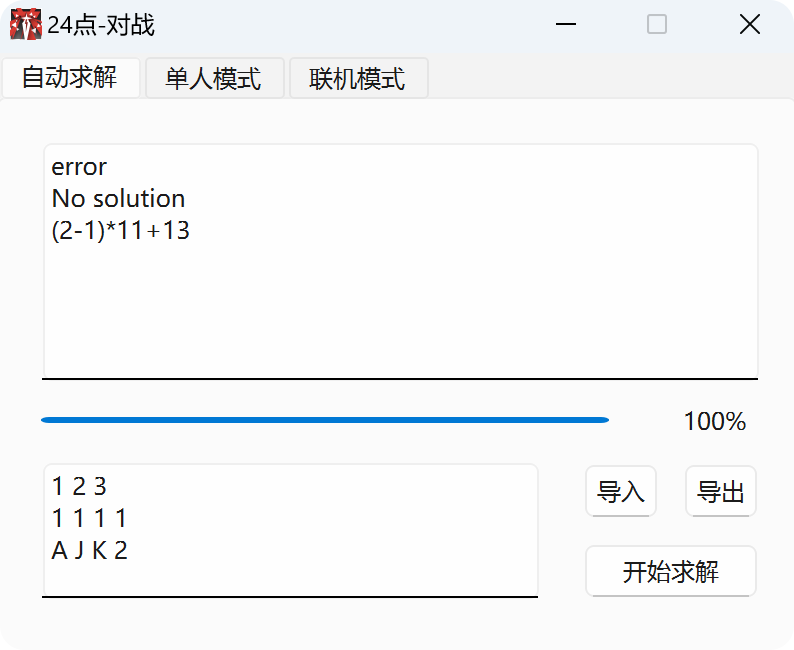

### 保存到文件(课程大作业要求内容)
按下```导出```按钮, 将会弹出选择文件保存路径与文件名的窗口, 按照课程要求, 输出格式如下

**输出格式:**
* 若某行存在解, 在该行前面加上```+\t```
* 若某行不存在解, 在该行前面加上```-\t```
* 在文件最后附上求解情况总结, 格式为```有解的题目数量/全部题目数量```


## 单人模式
进行离线的单人练习, 包含题目生成, 提示, 答案验证

### UI展示
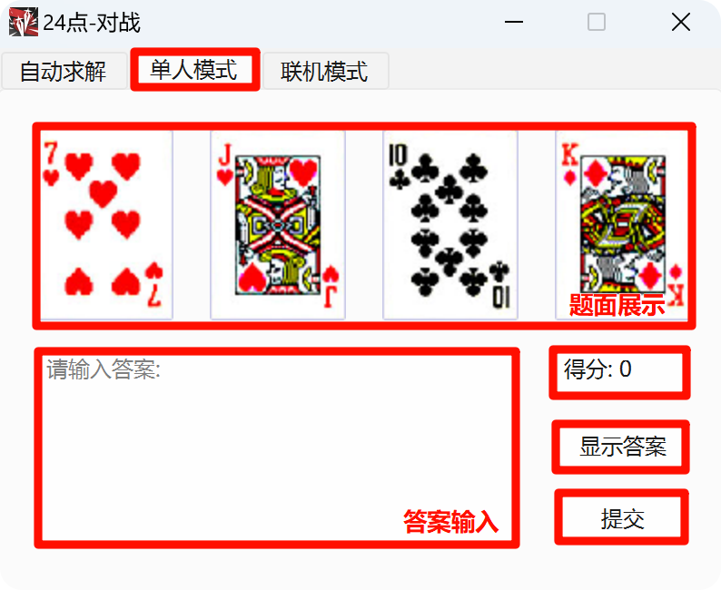
纸牌素材来源: [微软空当接龙](https://en.wikipedia.org/wiki/Microsoft_FreeCell)

### 题面展示
随机生成四个1-13的随机数并保证存在二十四点游戏的解, 通过一个伪随机算法生成花色(具体见源码 效果见下图), 可以保证相同数字花色不同, 并且四张牌花色尽量均匀分布, 最后将对应牌面展示

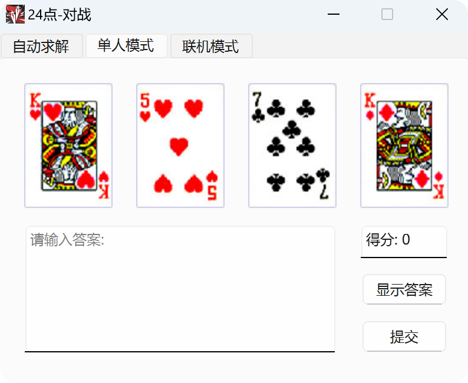

### 显示答案
按下```显示答案```, 将会调用自动求解中的对应函数进行求解, 同时会扣除两点得分

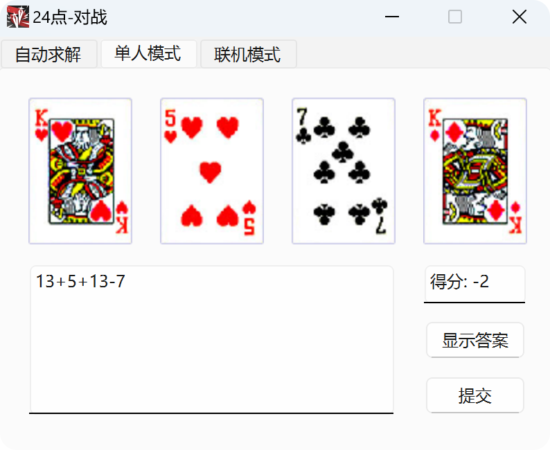

### 提交答案
按下```提交答案```, 将会检查答案是否正确, 若正确将获得一分, 若输入不符合题面要求将显示对应报错, 若计算结果有误, 将会展示对应错误值

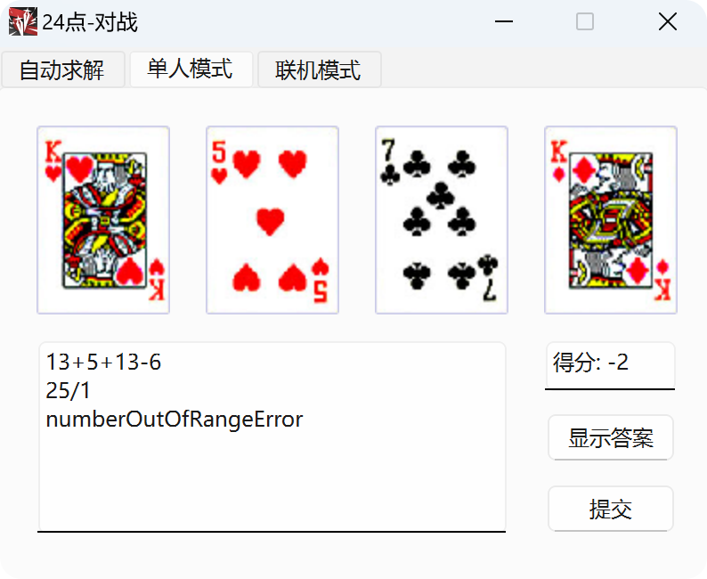
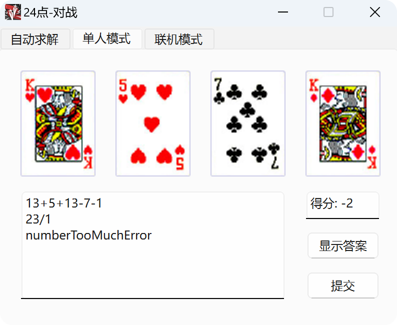


## 联机模式
联机模式(或许)支持局域网联机, 已知在打开多个程序后, 可以进行对战

### UI展示

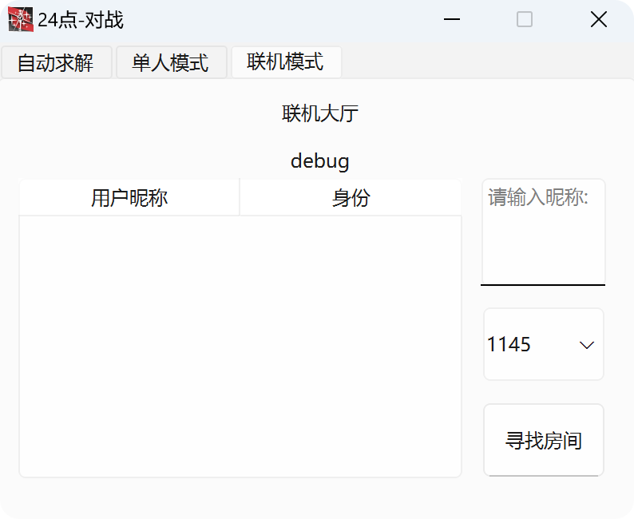

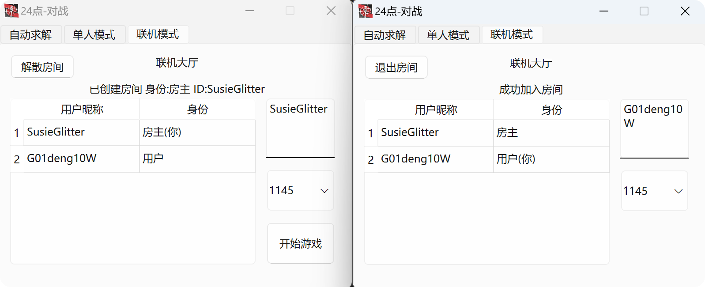

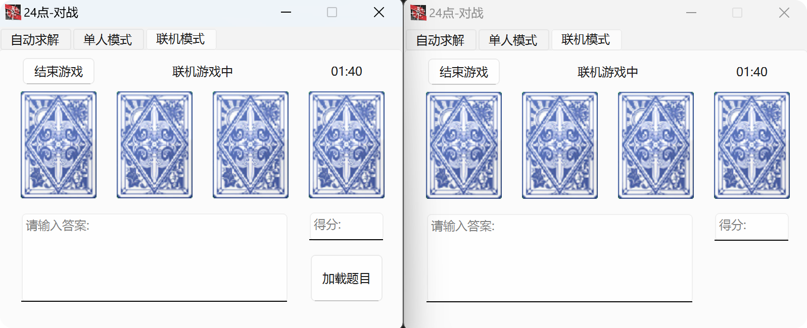

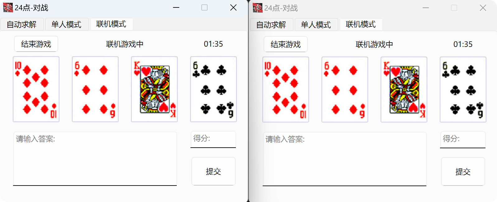

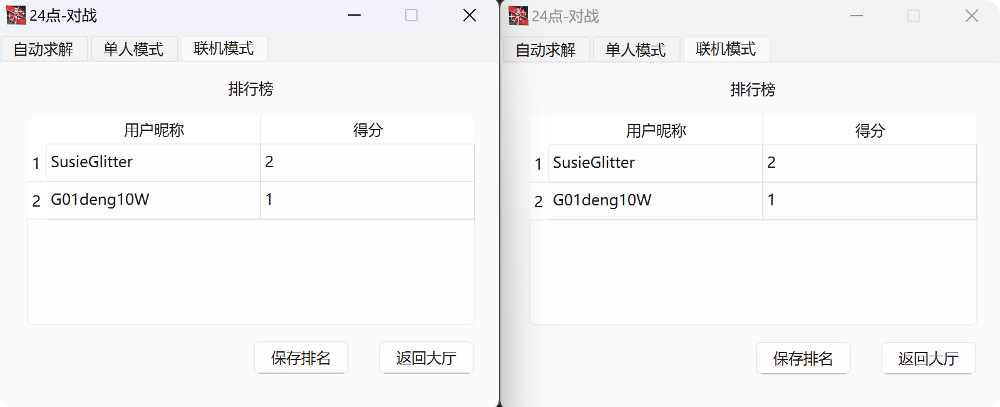

### 功能介绍
可以进行联网对战, 采用```QUdpSocket```进行消息的互通, 还有一些细节没有处理好, 将就着看吧