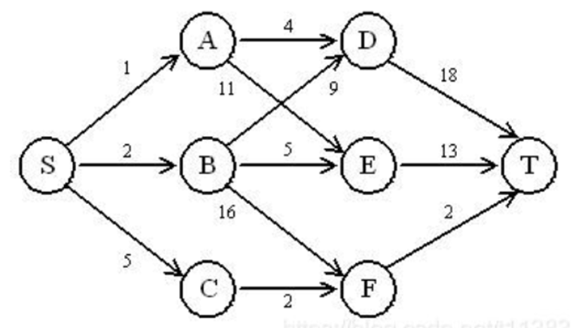

第1关：最短路径1

本题中我们计算多段图中的最短路径。

问题描述： 建立一个从源点S到终点T的多段图，权重在边上。求出从S到T的最短路径值，并输出相应的最短路径。

例如，图为一个四段（层）图。权重总和为：9，相应的路径为：S->C->F->T。

输入的格式：
S T             //第一行为开始和结束结点
S:A:1   S:B:2  ...      //接下来均为结点和结点的连接关系以及权重

输出：
9 S->C->F->T

注意：
（1）每个结点名称为一个字符串。如果存在多条最短路径，则根据结点元素的字典序排序，取第一条即可。例如：A->B->C->D 排序在A->BC->C->D 之前；
（2）请提供6个上述图例（测试用例），并进行计算。你的最大的一个测试用例层数应该不小于10段（层）。
（3）为了简化题目，测试用例用不包含环，也不存在跨段互连的情形。此外，输入中不存在任何格式问题。