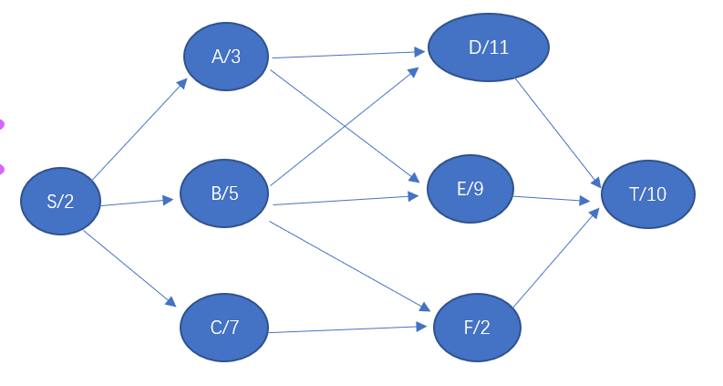

第2关：最短路径2

修改上述题目，将权重设置到结点上，如何建立一个路径，使得经历的结点的权重总和最小（首尾结点的权重也计算在内）。

例如，根据下图，最短路径为：S->B->F->T，权重为19

输入格式：
S T            //第一行：首尾结点
S:2 A:3 … //第二行：罗列所有的结点的权重
S:A S:B    //第三行：罗列所有的结点互联关系

注意：
（1）请提供6个上述图例，并进行计算。
（2）你的最大的一个测试用例层数应该不小于10段（层）。
（3）为了简化题目，测试用例用不包含环，也不存在跨段互连的情形。
（4）输入中不存在任何格式问题。
（5）如果存在多条最短路径，则根据结点元素的字典序排序，取第一条即可。